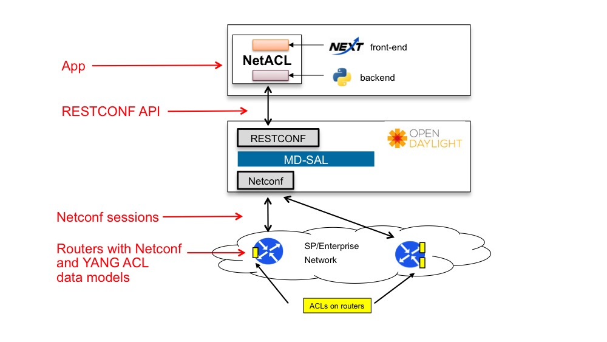

# OpenDaylight netACL App

OpenDaylight (ODL) is an open-source application development and delivery platform. Access Control Lists (ACL) are configuration statements deployed on routers intended to permit or deny traffic. They are typically used to filter traffic for security or administrative reasons. netACL is an application developed on top of ODL enabling the user to program ACLs on routers. 

## Team:

- Ilia Abashin
- Niklas Montin
- Alex Zverev
- Chris Metz
- Stacy Ling
- Bob Shi
- Giles Heron


### Project demo Link:

[https://github.com/CiscoDevNet/netACL](https://github.com/CiscoDevNet/netACL)

### Contact Email:

<netacl-app@external.cisco.com>

### Social Tags:

SDN, Open Source, NexT, IP, MPLS, BGP, BGP-LS, ACL, ACE, RESTCONF API, YANG

### Project Kick-off Date:

February 2016

### Current Status:

Beta

### Application Overview

ACLs are a fundamental portion of the configuration of routers in enterprise and SP networks. ACLs (composed of multiple access control elements (ACEs)) are applied on a per-router/per-interface basis. Operators are faced with the daunting task of ACL management and deployment given a large number of routers in a network. The work involved is order O(# of routers * # of interfaces per router)

In most (if not all) cases, operators resort to customized scripts. These require constant maintenance and worse, must support multi-vendor networks. An application that "abstracts away" the specifics of ACL configuration and makes it easier automate deployment is required. Add a nice GUI, multi-vendor support, and make it open source - all good.

netACL addresses all of the requirements. netACL visualizes a router network and allows the operator to easily define ACLs, then point/click for deployment. It runs on top of ODL and uses NETCONF to exchange ACL configuration information with the router(s).

The architecture of netACL is depicted here.


Figure 1. netACL Architecture

Working from the bottom up first. The desired end result is a router network with ACLs configured on specific interfaces. There is a YANG model describing what values can be configured on a router and what operational stats related to ACLs can be extracted. A NETCONF session is present from an ODL southbound plug-in and a NETCONF server on the routers. NETCONF is used to convey ACL configuration parameters to the routers. RESTCONF APIs specific to ACL management are auto-generated from ODL based on ACL YANG models. 

Note: Not shown but present in this application is a BGP-LS session between ODL and a router configured as a BGP-LS speaker. The netACL app uses this information to render a view of the network topology in netACL.

The front-end of the app uses the NeXt UI framework to render topologies and ACL configuration and management forms. This is open source and a [formal ODL project](https://wiki.opendaylight.org/view/NeXt:Main).
 
The back-end of the app employs a number of Python modules. It interacts with the front-end "northbound" while executing ACL-specific RESTCONF API requests and responses with ODL. The combination of the netACL front-end and back-end provides an excellent example of a working ODL application.


### netACL Operations

Described in **_Running the netACL app_** section below.

## Getting started

### Run frontend:
1. Run ```pip install -r frontend/requirements.txt``` in your python environment
2. Run ```python -m frontend.rest_server_v5```

### Run backend:
1. Run ```pip install -r backend/requirements.txt``` in your python environment
2. Create "backend/local_settings.py" with corresponding "backend/settings.py" variables.
  1. ```controller_address``` and ```controller_auth``` variables should be set to establish connection to a working ODL instance with a running network topology. *(TBD - supported controller versions)* 
3. Make sure current user has enough permissions to create system path specified in "log_file" variable
4. Run ```python -m backend.app```

## Running the netACL app
After deploying [frontend](#run-frontend) and [backend](#run-backend):

1. Open your browser. *(TBD - supported browsers)*
2. Go to ACL app index page, which can be located at: ```%YOUR_HOST%:%YOUR_PORT%/cisco-ctao/apps/acl/index.html```, where ```%YOUR_HOST%``` and ```%YOUR_PORT%``` should be substituted by host name and port number respectively of where **frontend** is deployed. You should see the main app screen:

3. Enter an existing node name in the search field in the upper left corner of the page. You'll see a list of existing network interfaces on this node.

4. Select an interface and click *add to selection list*, then click *Add ACL*.

5. Choose *New from blank ACL* or *New from template*. Here is an example of a preset template:

6. Click *Deploy Inbound* or *Deploy Outbound*, enter a name and hit *Confirm*. Click *Back to full map view*, then the chevron near selected ACLs and subsequently *View ACL*. You'll see the ACL applied to your selected interface.

7. The ACL is now applied to the interface.

## Adding apps
1. Create a python package with name equal to app name
2. Create following python modules in app package with specific contents (list is to be altered):
  1. ```topology_parser.py```:
    1. Class ```Topology``` with ```parse_controller_topology``` method that handles parsing topology from controller format to UI usable one
  2. ```handler.py```:
    1. Class ```Handler``` that subclasses ```tornado.web.RequestHandler``` class. It should provide HTTP verb methods (at least *get*, *post*, *put* and *delete*) and behave like a tornado handler
3. Add app name to ```INSTALLED_APPS``` list in ```backend/local_settings.py``` file
4. Run backend and check logs to see if app connection has been successful

