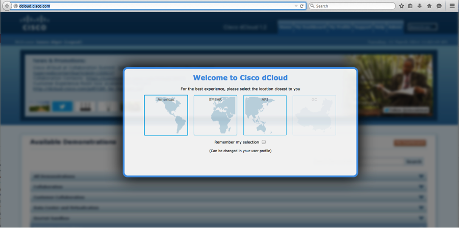
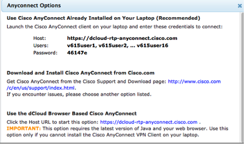
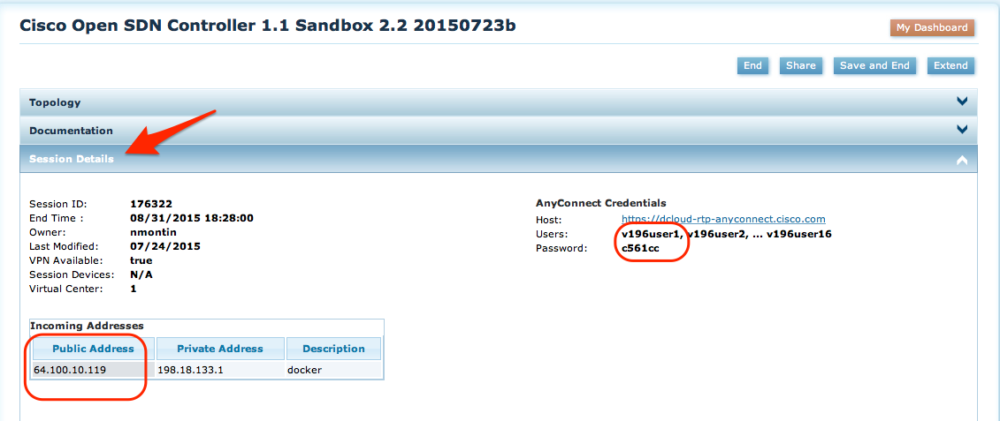

# Running your OpenDaylight APPs towards a Topology
Updated: 20160711

The netACL app assume that you can connect to an OpenDaylight (ODL) Controller.

You will need the following information:

1. IP address and Port of controller
2. Authorization in the form of username and password

You topology would also need to be configured to interact with the ODL controller; 
- BGP peering with BGP-LS speaker (i.e. one of the routers configured with BGP-LS). 
- This app also needs NETCONF sessions to be active between the controller and all routers.

To simplify this step, we have implement a demonstration ODL controller and network topology available at [dCloud](dcloud.cisco.com). Below you will find the information required to have these apps interact with dCloud.

# Accessing OpenDaylight Beryllium SR1/SR2 at dCloud

First, you need to connect to [dcloud.cisco.com](http://dcloud.cisco.com) and signup. If you are a new user, you may need to first signup at [cco.cisco.com](http://cco.cisco.com), and then at [dcloud](http://dcloud.cisco.com).

When connecting to dcloud, you will first be prompted to select a datacenter near you (shown in 1). After that you will be prompted to set up a profile.

- If you have any trouble in getting your profile setup, please consult the Help tab.



Figure 1 dCloud data center selection screen

Once connected to [dCloud](http://dcloud.cisco.com), you will see the content overview. From there, select Service Provider, and locate the [OpenDayLight Beryllium SR2 with Apps with 8 nodes v1.](https://dcloud-cms.cisco.com/demo/opendaylight-beryllium-sr2-with-apps-with-8-nodes-v1) demo.

Note that any newer ODL demo should work fine as well.

- Then select Start/Schedule and pick a time for when you want to have access to the topology, or now.
- Select the Session End time.
- Click Next and answer the "use" questions.


Now you are done and you should have a session being started for you.

# How do I configure my APP to talk to my dCloud ODL + topology?

**Note:**
The netACL app has been tested with Lithium SR3 and Beryllium SR1 and SR2


**No changes are needed to run this app towards the above-mentioned topology in dCloud.**

For other setups, you may need to change ip/port/auth details.
This is done int the **backend/settings.py** file.

``` python
 66     # Controller
 67
 68     controller_address = {
 69         'scheme': 'http',
 70         'host': '198.18.1.80',
 71         'port': 8181
 72     }
 73
 74     controller_auth = {
 75         'username': 'admin',
 76         'password': 'admin'
 77     }
```

These values are fine once you have any-connected in to the dCloud session.
(To use your own topology, edit these values to point to your local controller.)

# How do I connect my laptop to the dCloud topology?

Depending on where you have installed the apps, you may want to consider different options to access your active dCloud session.

1. Cisco AnyConnect Client - [http://www.cisco.com/c/en/us/products/security/anyconnect-secure-mobility-client/index.html](http://www.cisco.com/c/en/us/products/security/anyconnect-secure-mobility-client/index.html)
 - [Show Me How to connect](https://dcloud-cms.cisco.com/help/install_anyconnect_pc_mac) 

2. Openconnect – see [https://wiki.archlinux.org/index.php/OpenConnect](https://wiki.archlinux.org/index.php/OpenConnect)

Regardless of client, you will need to check the access details for your session.

At dcloud.cisco.com, and the datacenter you have selected – click _My Dashboard_ and you will find your active session(s) listed there.

Select you session's '_View'_ button and then '_Review Session Info_', which takes you to _Session Details_. In Session Details, you will find your AnyConnect credentials.

And if you 'click here for available options', you will see a view like this:



Figure 2 Anyconnect session credentials screen

Once connected, your laptop will be in the same network as the routers in your topology and the ODL controller.


### dCloud Topology access details:

|                 | IP              | Port          | Username | Password | Notes                            |
|-----------------|-----------------|---------------|----------|----------|----------------------------------|
| **Karaf**       | 198.18.1.80     | 8101          | karaf    | karaf    | SSH exit command: ‘shell:logout’ |
| **ODL host**    | 198.18.1.80     | 8022          | cisco    | cisco    | SSH                              |
| **User VM**    | 198.18.1.80     | 8222          | cisco    | cisco    | SSH                              |
| **Restconf**    | 198.18.1.80     | 8080 and 8181 | admin    | admin    |                                  |
| **XRV Routers** | 198.18.1.30-.37 | 23            | cisco    | cisco    | Telnet                           |


# How to Configure and Launch netACL APP

1. Schedule and have a dCloud Beryllium ODL demo (per the above).

2. Download netACL app from github located at [CiscoDevnet's Github](https://github.com/CiscoDevNet/netACL)

 ```
 git clone https://github.com/CiscoDevNet/netACL
 cd 
 ```
 
3. Software prerequisites (above and beyond what is required for dCloud access):

 ```
pip2.7 install -r frontend/requirements.txt
pip2.7 install -r backend/requirements.txt
```

 **Note:** If installing somewhere else than in the demo's UserVM, you should probably use _pip_ instead of _pip.2.7_


4. You should the following in your **netACL** directory. (disregard dates)


 ```
total 48
drwxr-xr-x  12 staff    408 Jul  3 13:00 .
drwxr-xr-x  40 staff   1360 Jun 27 21:33 ..
drwxr-xr-x  16 staff    544 Jul  2 16:08 .git
-rw-r--r--   1 staff     94 Jul  2 15:48 .gitignore
drwxr-xr-x   9 staff    306 Jul  3 13:07 .idea
-rw-r--r--   1 staff   1298 Jun 27 21:33 CONTRIBUTING.md
-rw-r--r--   1 staff  11348 Jun 27 21:33 LICENSE
-rw-r--r--   1 staff   3161 Jul  2 16:06 README.md
drwxr-xr-x  16 staff    544 Jul  2 15:49 backend
drwxr-xr-x   4 staff    136 Jul  3 13:07 dCloud
drwxr-xr-x  16 staff    544 Jul  2 15:50 frontend
drwxr-xr-x   7 staff    238 Jul  2 15:48 images
```


5. Type in the following command to start the frontend rest_server:

 ```
 python2.7 -m frontend.rest_server_v5
 ```

6. Start the backend of the app with the command:

 ```
 python -m backend.app
 ```

7. Open your Chrome Browser - URL to launch netACL app: [http:/198.18.1.80:8020/cisco-ctao/apps/acl/index.html](http://198.18.1.80:8020/cisco-ctao/apps/acl/index.html). This assumes that your app is running in the demos UserVM.


# What if I don't have Cisco Anyconnect installed?

There are two options; either you use an alternate client, or you use dCloud's public ip solution.

## Alternate Anyconnect client
-If your client can't run Cisco Anyconnect, you want to try another client like OpenConnect.

## dCloud Topology Public IP Access
For some of our demos, we have enabled public IP access. In the picture below, you see how to find your public_ip address, and your anyconnect credentials.

You can use them directly from your Pathman_SR app, by changing the **backend/settings.py**  file as described below.

``` python
 66     # Controller
 67
 68     controller_address = {
 69         'scheme': 'http',
 70         'host': '64.100.10.119',  # Public IP for your session
 71         'port': 6644              # Must be 6644 for public ip access
 72     }
 73
 74     controller_auth = {
 75         'username': 'v196user1',  # your sessions anyconnect userid for user1
 76         'password': 'c561cc'      # your sessions anyconnect password
 77     }
```



### FAQ on Public IP and dCloud Demos
1. Can more than one app run towards the same topology from your machine - **Yes**
2. Can someone else access your topology? - **No**, unless you share access credentials with them.
3. Should you share your access credentials with everyone through my blog/Facebook or other? **No**, that is probably **not** a good idea.
4. Can I choose to collaborate with few others? **Yes**, you can either share your demo with them through the **Share** button on the dCloud UI, or share your sessions access credentials. Just remember that once shared, they have learned your credentials and can access your setup at any time.
5. How long can I have my topology running? Your session can be scheduled to run for, from 1h to 5 Days.
6. Is there a charge for using dCloud? - **No**, currently there is no charge for using dcloud for this purpose.

# Caveats

No known caveats at this time.
